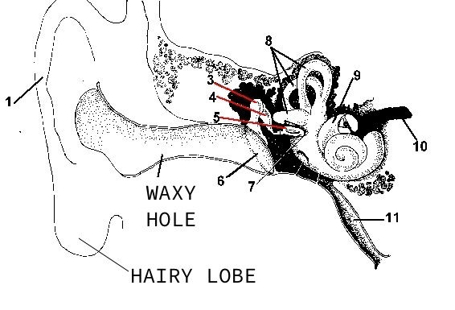

## A Listening Guide [^1]

### A Common Reaction

A common reaction to first exposure to the AMBUSHER SOUND is to think, "What in the Devil am I listening to? Golly, what it that new feeling?" Perhaps you have thought this yourself. Well, worry not dear reader; this helpful guide is about to lay down all the straight facts about the physiology, the psychology, and the phrenology of the AMBUSHER SOUND.

### How do you hear?

It turns out that our primary listening organ is our ear. And, the good news is, you have one. See Diagram 1. Note that the important parts of the ear are documented. Most sound, including ordinary music, is conveyed through the air and into your waxy hole, where small motors transfer the air-sound into brain-sound so that you can do things like yell at your kids or turn off the radio. Unlike most sound, AMBUSHER SOUND is received by your hairy lobes. The lobes exude a sticky hormone juice that binds with the sound and carries it across the skin/blood barrier. Once in your blood, the AMBUSHER SOUND makes its way to the major nerve centers and causes the release of sonotones and heloglobes that trigger the by now familiar feeling of euphoria/nausea.

### Where does the AMBUSHER SOUND come from?

As everyone knows, all music comes directly from Satan. He builds up a Hellful cacophony down below that circles the core of the Earth and permeates his fiery domain. The sound is then loosed on the world through the evil that is amplified instruments aided by the mysterious power of electricity. AMBUSHER makes use of His Own Devilish Electric Guitar and The Very Evil Analog Synth Modules to pick up the Hellphony, make it perceivable, and bend it to our wishes. Although all sound starts out evil, once the sinister sonorous super-highway has coursed its way through the AMBUSHER amp-fort, the sound becomes at first neutral and then finally, just before it is wrought through the loudspeakers, beneficent.

### What in the french toast am I hearing

The Theory Of Sound is the result of years of scientific research. This groundbreaking theory explains that sound has nine components: Pitch (P), Timbre (T), Harmonics (H), Loudness (L), Rhythm (R), Attack (A), Sustain (S), Decay (D), and Speed (E). In a stunning study about to be published by a major U.S. university, the AMBUSHER SOUND will be proven to include three additional components that are missing from every other modern sound source. These three critical components, called Hurting (U), Wain (W), and Dipshitness (I), have also been found in trace amounts in core samples taken from the Bodhi Tree that date to the time when Siddhartha Gautama, the Holy Buddha Himself, sat beneath it. The scientific community has long suspected (but never proved) that a rip in time will develop in the near future and cause a live AMBUSHER performance to leak into the past and become caught in a temporal vortex around Buddha’s sacred tree. This tear in the very fabric of space-time could happen this evening. If it does, dear reader, just stay calm and remember: if you see a younger or older version of yourself, please, in the name of all that is holy, look away! 

But we digress. Back to the question: What are you hearing? Well, clearly, it is the extremely abnormal addition of the (U, W, I) sonic components that cause the stirring in your loins, the spinal tingling, and the unexplainable visual phenomena. This dreivector, known only to be present in AMBUSHER SOUND, cannot be found elsewhere. And it is precisely that which you desperately crave when it is absent, and exactly that for which you paid the low, low price of admission.

#### Footnotes

[^1]: [Soundcloud](https://soundcloud.com/ambushersound)
